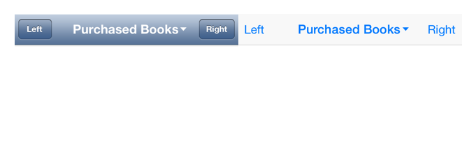

SubMenuArrowButton
==================

iBooks (iOS 7) title view style button.




## Requirements

iOS 6.1 or later.

## Example Usage

``` objective-c
WAHSubMenuArrowButton *subMenuButton = [WAHSubMenuArrowButton subMenuArrowButtonWithTitle:@"Purchased Books"];
subMenuButton.titleLabel.font = [UIFont boldSystemFontOfSize:18.0];
[subMenuButton sizeToFit];
viewController.navigationItem.titleView = subMenuButton;
```
